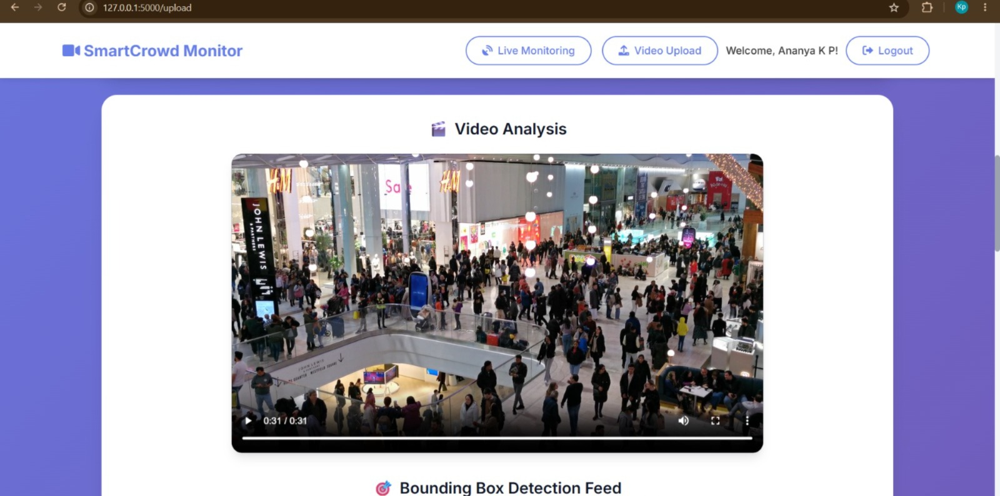
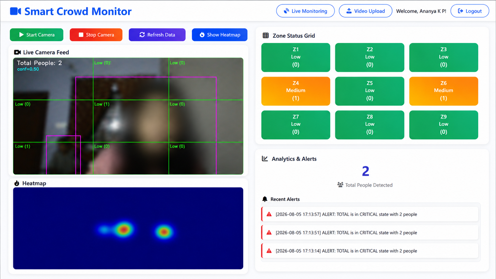
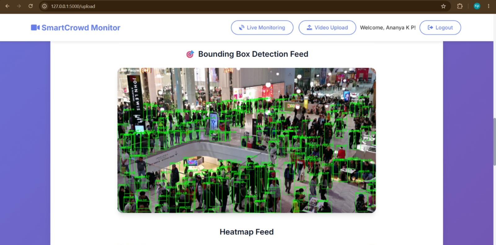
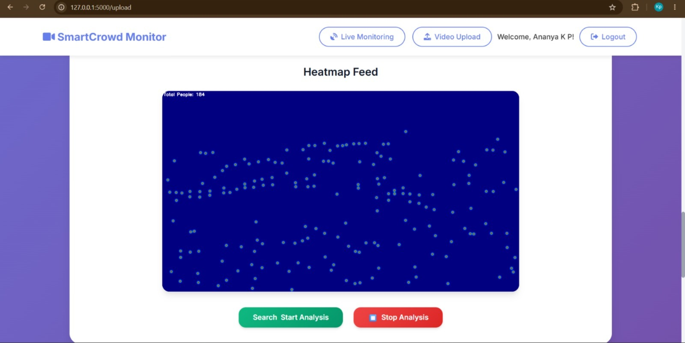
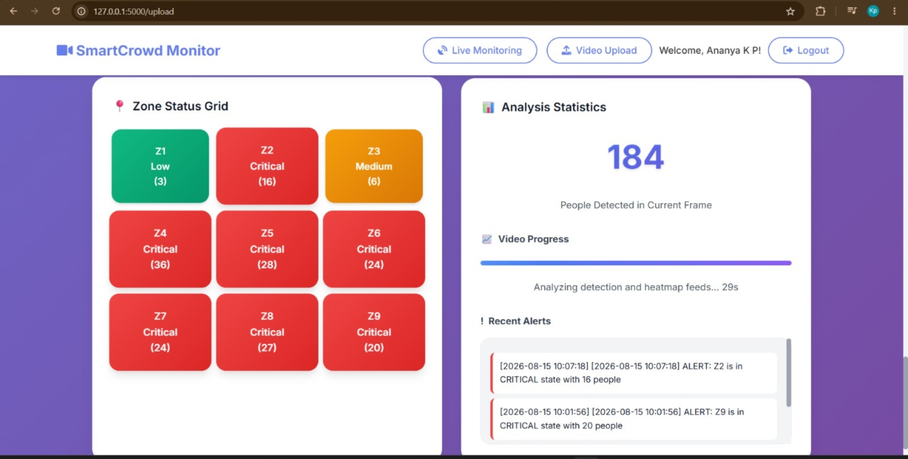

# SmartCrowd Monitor

SmartCrowd Monitor is an AI-based crowd density monitoring system built with Flask, OpenCV, and YOLOv8. The system supports live camera monitoring and uploaded video analysis with zone-wise crowd classification, bounding-box detection, heatmap visualization, and critical crowd alerts.

## Features

- User registration and login
- Live camera crowd monitoring
- Uploaded video crowd analysis
- YOLOv8 person detection
- Bounding boxes with total people count
- Heatmap visualization for crowded areas
- 3x3 zone-wise crowd status grid
- Alert generation for critical crowd density
- Email alert support through configurable SMTP settings
- Responsive web dashboard

## Project Screens

| Dashboard | Live Monitoring |
|---|---|
|  |  |

| Uploaded Video Detection | Heatmap Result |
|---|---|
|  |  |

| Critical Alert Result |
|---|
|  |

## Results

| Module | Output |
|---|---|
| Live Monitoring | Detects people from webcam feed and classifies each zone as Low, Medium, High, or Critical. |
| Uploaded Video Detection | Detects people in uploaded videos using YOLOv8 and displays bounding boxes with total count. |
| Heatmap | Shows crowd concentration areas visually using density heatmap. |
| Alerts | Generates alerts when any zone reaches Critical crowd level. |

## Threshold Logic

### Live Video

| People Count Per Zone | Status |
|---|---|
| 0 | Low |
| 1 | Medium |
| 2 | High |
| Above 2 | Critical with alert |

### Uploaded Video

| People Count Per Zone | Status |
|---|---|
| 0-5 | Low |
| 6-10 | Medium |
| 11-15 | High |
| Above 15 | Critical with alert |

## Technology Stack

- Python
- Flask
- OpenCV
- YOLOv8 / Ultralytics
- NumPy
- HTML, CSS, JavaScript
- SQLite
- Firebase support

## Folder Structure

```text
SmartCrowd Monitor/
├── backend/
│   ├── dashboard_app.py
│   ├── firebase_config.py
│   ├── zone_polygon_utils.py
│   ├── config.example.json
│   └── templates/
├── results/
│   └── README.md
├── requirements.txt
├── .gitignore
└── README.md
```

## Installation

1. Clone the repository:

```bash
git clone https://github.com/your-username/SmartCrowd-Monitor.git
cd SmartCrowd-Monitor
```

2. Create and activate a virtual environment:

```bash
python -m venv venv
venv\Scripts\activate
```

3. Install dependencies:

```bash
pip install -r requirements.txt
```

4. Create local configuration:

```bash
copy backend\config.example.json backend\config.json
```

5. Run the application:

```bash
cd backend
python dashboard_app.py
```

6. Open in browser:

```text
http://127.0.0.1:5000
```

## How to Use

1. Register or log in.
2. Open Live Monitoring to start webcam-based crowd detection.
3. Open Video Upload to upload a crowd video.
4. Click Start Analysis.
5. View bounding-box detection, total count, heatmap, zone grid, and alerts.

## Important Notes

- Do not upload `backend/config.json` if it contains email passwords or private keys.
- Uploaded videos, databases, cache files, and virtual environments are ignored from GitHub.
- For best results in crowded videos, use clear video footage with good lighting and higher resolution.
- YOLO may not detect every person in highly dense or heavily occluded scenes, but tiled detection improves small-person detection.

## Future Enhancements

- Export analysis reports as PDF or CSV
- Add graph-based crowd trend analysis
- Add role-based admin dashboard
- Improve dense-crowd counting with density-map models such as CSRNet or MCNN
- Deploy the application on cloud hosting

## Author

Ananya K P